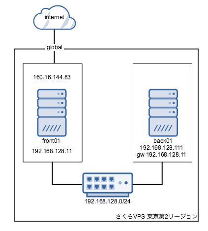
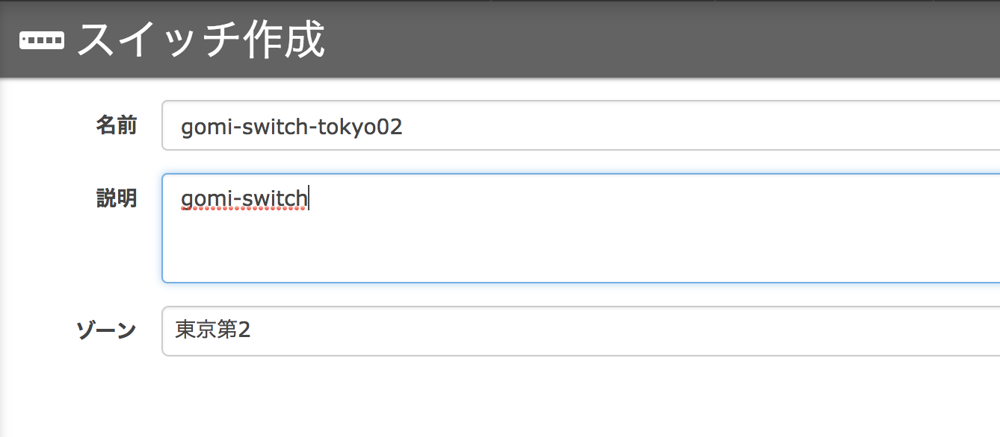
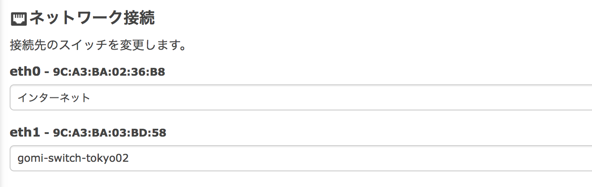

# さくらVPSのL2スイッチを利用してローカルネットワークを構成する

さくら VPS のスイッチを利用して次のような構成を作る手順メモ



### 1. さくらVPS管理画面上でスイッチを作成する




### 2. サーバーを停止する

作業対象サーバー内から shutdown コマンドでサーバーを停止する


### 3. 接続先スイッチ追加

接続先スイッチとして eth1 に先ほど作ったスイッチを指定する




### 3. サーバーを起動する

さくらVPS 管理画面からサーバーを起動する


### 4. IP アドレスの設定

次のように IP アドレスを割り当てた

* front01.eth1: 192.168.128.11/24
* back01.eth1: 192.168.128.111/24

### 5. front01 のネットワーク設定

back01 からインターネットに出るときは front01 を経由して外にでるために、front に NAPT 設定を入れる。
firewalld を使う場合以下のような形で設定する。

```
# firewall-cmd --get-active-zone
public
interfaces: eth0 eth1

# firewall-cmd --change-interface=eth0 --zone=external --permanent
success

# firewall-cmd --change-interface=eth1 --zone=internal --permanent
success

# firewall-cmd --get-active-zone
internal
  interfaces: eth1
external
  interfaces: eth0

# firewall-cmd --zone=external --add-masquerade --permanent
success
```

### 6. back01 のネットワーク設定

back01 はインターネットに晒したくないサーバーにあたるため、eth0 の自動起動をオフにしてインターフェースを落とす。今回は nmtui 経由でやった。また、このままだと back01 はインターネットに出られないため、gateway として front01 の back側 IP を指定した。諸々設定後、以下で動作確認して無事 global 側の IP アドレスでインターネットに出られていれば、うまく設定できたということになる。

```
curl checkip.amazonaws.com
160.16.144.83 #=> front01 の グローバル側 IP
```
