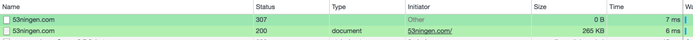

Apach と nginx への HSTS 設定
=====

## HSTS(HTTP Strict Transport Security)とは?

* SSL に対応しているウェブサーバーへの HTTP リクエストに対し、サーバー側がレスポンスヘッダに SSL 通信が可能であることを表すデータを付与することにより、ブラウザに HTTPS での通信を行うことを促す仕組みを HSTS とよぶ
* RFC6797 で定義される: https://tools.ietf.org/html/rfc6797
* preload と併用することにより 301 でリダイレクト先を指定する際、そのリダイレクト先が改ざんされていないことを保証できない欠点を補える

## 技術的な仕組み

1. ユーザーが HTTP リクエストを対象サーバーに送る
2. サーバーは https エンドポイントへ301リダイレクトレスポンスを返す
3. https エンドポイントはレスポンスヘッダに 以下を付与しブラウザに HTTPS で通信を行うことを促す
   * `Strict-Transport-Security "max-age=31536000; includeSubDomains"`
   * ここで max-age はブラウザ側に当該ドメインが HTTPS 通信に対応しているという事実をキャッシュする長さ（秒）である
   * includeSubDomains をつけるとサブドメインを含めて、HTTPS 通信に対応しているということを伝達する
4. HSTS に対応しているブラウザは、その後対象ドメインに対してはデフォルトで HTTPS を見に行く

## 注意点

* 誤った設定であろうと、一度 Strict-Transport-Security ヘッダーを受け取ったHSTS対応のブラウザは max-age の時間分、対象ドメインにHTTPでリクエストを送ろうとしても HTTPS に切り替えてしまう
* 誤設定の可能性を考慮すると、最初の設定の max-age は短くしておき、作業ミスがあった際の影響を小さく留めておくとよい

## Apache, nginx への設定

* 基本的にはレスポンスヘッダに `Strict-Transport-Secutiry` を追加するだけ
  * Apach は mod_header モジュールを用いて、レスポンスヘッダを追加
  * nginx は add_header ディレクティブで、レスポンスヘッダを追加

### Apache  

```
Header set Strict-Transport-Security "max-age=31536000; includeSubDomains"
```

### nginx

```
add_header Strict-Transport-Security 'max-age=31536000; includeSubDomains; preload';
```

### 動作確認

```
% curl --head 53ningen.com
HTTP/1.1 301 Moved Permanently
Server: nginx
Date: Thu, 04 Jan 2018 14:05:38 GMT
Content-Type: text/html
Content-Length: 178
Connection: keep-alive
Location: https://53ningen.com/
```

```
% curl --head https://53ningen.com
HTTP/1.1 200 OK
Server: nginx
Date: Wed, 10 Jan 2018 08:22:49 GMT
Content-Type: text/html; charset=UTF-8
Connection: keep-alive
X-Powered-By: PHP/7.1.12
Vary: Accept-Encoding, Cookie
Cache-Control: max-age=3, must-revalidate
Strict-Transport-Security: max-age=31536000; includeSubDomains; preload
```

### preload の登録

[https://hstspreload.org/](https://hstspreload.org/) で登録する


### chrome での処理のされ方

307 でリダイレクトがかかる模様



### ssllabs での確認

[https://www.ssllabs.com/ssltest/analyze.html?d=53ningen.com](https://www.ssllabs.com/ssltest/analyze.html?d=53ningen.com) で見れば HSTS が有効になっていることがわかる

```
Strict Transport Security (HSTS)	Yes
max-age=31536000; includeSubDomains; preload
HSTS Preloading	Not in: Chrome  Edge  Firefox  IE
```
