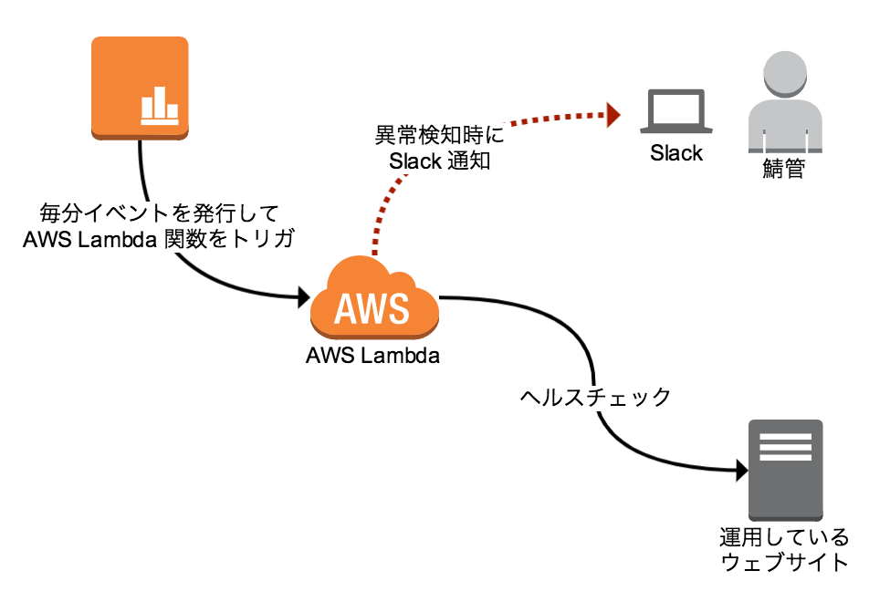

AWS Lambda を用いたウェブサイトの外形監視
===

## ウェブサイトの外形監視とは?

　ウェブサイトがユーザーからきちんと閲覧できるかどうかを監視するという至極単純なものが「ウェブサイトの外形監視」です。外形というワードが入っているとおり、ユーザー側から名前解決を正常に行うことができ、宛先にきちんとリクエストを行え、妥当な時間内に正常なレスポンスを受け取ることができるかをチェックすることが目的になると思います。

　したがって、構築されたサーバーとはネットワーク的にも物理的にも独立した場所から監視を行えると良いのですが、そうすると外形監視サーバーのお守りをしなければならず、個人でちゃんとやろうとすると微妙に面倒ではあります。


## AWS Lambda を用いたウェブサイトの外形監視

　**AWS Lambda** は、オンデマンドでコードの断片を実行することができるアプリケーション基盤です。あらかじめサーバーを立てて置かなくても、実行したいコードを配置しておき、実行したいときにサーバーのことなど何も考えずに呼び出すことができます。ウェブサイトの外形監視は、せいぜいリクエストを送ってステータスコードやレスポンスタイムなどを見てあげるだけの簡単な処理であるため、相性がよさそうです。

　サービスを AWS 以外のクラウドや、オンプレミスでサービスを運用している場合には物理・ネットワーク的に異なる条件から対象を監視することができます。また、AWS Lambda は複数のリージョンにデプロイすることが可能なため、AWSを利用している場合でも、世界中の様々なリージョンを利用することにより、地理的に異なる場所から対象を監視することが可能です。

　AWS には **Route 53** にすでにヘルスチェッカーが存在しているのですが、色々なオプションをちまちまつけていくと少しずつお金を取られていくので（といっても大した額ではないんですが...）、 #okane_nai 勢の私は AWS Lambda の無料利用枠で同じようなことが実現できるのではないかと思い、今回試してみることにしました。


### システムの全体像

　AWS Lambda の実行トリガーはイベントソースと呼ばれています。外形監視としては定期的に実行できる cron のような振る舞いを実現できればよさそうです。**AWS CloudWatch Events** がちょうどそのようなものに該当しており、cron 式や rate 式によって以下のように簡単にイベント発行のスケジューリングが可能です。


　単純な外形監視の通知先として Slack への通知を考えるとするならば、最小構成としては AWS Lambda と AWS CloudWatch Events を用いた仕組みの全体像と稼働のイメージは以下のような図になります。



　AWS Lambda で動くコードは、自由にカスタマイズできる普通のコードですので、たとえば Twillio API と連携して異常検知時に電話を鳴らしたり、レスポンスに特定の文字列が含まれているかチェックしたりなど様々なことができます。また、Amazon SNS を利用して様々な通知連携を行ったり、DynamoDB などを用いて監視データを蓄積したりすることも可能です。個人でお遊び監視を入れるには監視サーバーをお守りする必要もなく、楽しいおもちゃになるのではないでしょうか。

* 参考資料
  * [サポートされているイベントソース - AWS Lambda](https://docs.aws.amazon.com/ja_jp/lambda/latest/dg/invoking-lambda-function.html)


## AWS Lambda を用いた外形監視のコスト見積もり

2018年1月現在、AWS Lambda には以下のような無料枠が設けられています。

* リクエスト: 月間 1,000,000 件
* コンピューティング時間: 月間 400,000 GB-秒

したがって、リクエスト数とコンピューティング時間の2つの軸でコストを見積もる必要があります。

また AWS CloudWatch Events については単純に発行するイベント数に応じて課金がなされます。

* 参考資料
  * [AWS Lambda Pricing](https://aws.amazon.com/lambda/pricing/)
  * [AWS CloudWatch Pricing](https://aws.amazon.com/cloudwatch/pricing/)


### AWS Lambda リクエスト数の見積もり

　毎分ヘルスチェックをまわすとすれば、 `1 (req) * 60 (min) * 24 (hour) * 31 (day) = 44,640 (reqest)` となり、無料利用枠の中に余裕を持っておさまります。もし他の用途で無料利用枠を使い切っているとすれば、課金額は `44,640 (request) * 0.0000002 (USD/request) = 0.008928 (USD)` となります。


### AWS Lambda コンピューティング時間の見積もり

　node.js で動く HTTP リクエストを送る単純なプログラムであるため割り当てメモリは一番小さな 128MB (= 1/8 GB) で十分です。手元で稼働させている実績からほぼ 1000ms 以内にヘルスチェックが完了しているのですが、バッファをとって平均 2000ms かかると仮定して計算するならば、 `1/8  (GB) * 2 (sec) * 60 (min) * 24 (hour) * 31 (day) = 11,160 (GB-sec)` となり、無料利用枠におさまります。もし他の用途で無料利用枠を使い切っているとすれば、課金額は `11,160 (GB-sec) *  0.00001667 (USD) = 0.1935387 (USD)` となります。


### AWS CloudWatch Events の見積もり

　AWS CloudWatch Events は $1.00/100万イベントという料金になっているため、単純に `1 (event) * 60 (min) * 24 (hour) * 31 (day) = 44,640 (event) / 1000000 (event/USD) = 0.04464 (USD)` のお金が必要です。


### 総費用の見積もり

　無料利用枠を使っていないのであれば、AWS Lambda の費用はすべて枠内におさまっており、無料で稼働中のサーバーとは地理的に異なる場所に配置できる外形監視を導入することができます。また仮に無料利用枠を使い切っているとしても、`0.008928 + 0.1925387 + 0.04464 = 0.24610677 (USD)` の課金が発生します。**多分 27 円くらい取られます。** お財布には厳しいですが、気合いです。


## 外形監視のための AWS Lambda 関数の作成

　作るものは非常に単純で、node.js で HTTP リクエストをサーバーに送り、ステータスコードが 200 番台だったらオッケーで、その他の場合は Slack の incomming webhook を利用してメンションを飛ばすだけです。Slack の設定次第では、スマホにプッシュ通知とか飛ばせるので、面倒なこと考えずに手軽に検知手段が欲しいときにこの方法はコスパが良いのではないでしょうか。

　コードなどどうでもいいので、いますぐ試してみたいという方のために、簡単にデプロイできるような形にしておきましたので、[こちらの GitHub リポジトリ](https://github.com/53ningen/sousie)[^1] からクローンしてみてください。数ステップで AWS Lambda 上にデプロイしてお試しいただけます。

[^1]: リポジトリの名前は「異世界はスマートフォンとともに」のキャラクターである、スゥシィ・エルネア・オルトリンデ様の名前をお借りしました

### 基本的なコード

　暇人の趣味なので FlowType を使ってます。`request` を使ってリクエストを送って、ステータスコード見てるだけなので、基本的には以下のような簡単なコードを書いてアレコレしていくだけです。

```javascript
// @flow

import request from 'request-promise-native';

async getStatus(): Promise<Object> {
   const options = {
     method: 'GET',
     uri: 'https://exapmle.com',
     timeout: 3000,
     headers: {
       'User-Agent': 'Mozilla/5.0 (Oreore Health Checker;)'
     },
     resolveWithFullResponse: true
   };
   try {
     const { statusCode, statusMessage } = await request(options);
     return { statusCode, statusMessage };
   } catch (err) {
     console.log(JSON.stringify(err));
     if (err.response) {
       const statusCode = err.response.statusCode;
       const statusMessage = err.response.statusMessage;
       return { statusCode, statusMessage };
     } else {
       const statusCode = null;
       const statusMessage = err.message;
       return { statusCode, statusMessage };
     }
   }
 }
```

　ラムダ関数 1つで複数サイトの監視をさせるために、設定ファイルに書いた URL リストを舐めて、それぞれに対して上記のような関数を呼び出し、サービスの状態を並列に確認させています。このような仕組みで、現状手元で 10 エンドポイントくらいを監視させていますが、関数の実行時間はそれほどかわらず、結果としてはレスポンスが一番遅いエンドポイントに引きずられているような挙動に見えます。


### Apex を使った AWS Lambda 関数の管理

　AWS Lambda 関数のデプロイをマネジメントコンソールからやるのは面倒なので、[Serverless](https://serverless.com/) とか [Apex](http://apex.run/) などを使うと良いと思います。今回は簡単なものだったので、Apex を利用しました。適切な設定をすると次のようなワンコマンドで、AWS Lambda にデプロイすることができます。

```
apex deploy
```

ためしにデプロイした関数を実行したいときも次のようにとてもお手軽です。

```
apex invoke (関数名)
```


### 成果物を俺にも使わせろ

　どうぞどうぞ。[こちらの GitHub リポジトリ](https://github.com/53ningen/sousie)からクローンしてください。使うまでには次のような作業をしてください。

1. 必要なもの(aws-cli, apex)をインストール
2. `git clone git@github.com:53ningen/sousie.git && cd sousie`
3. マネジメントコンソールからラムダ関数が使う IAM ロールを作る
  * 詳しくは[このあたりの資料](https://docs.aws.amazon.com/ja_jp/IAM/latest/UserGuide/id_roles_create_for-service.html)を見てください
  * AWS CloudWatch ログ書き込み権限をアタッチする
4. `cp ./project.json.template ./project.json` して `role` の欄に作った IAM Role の ARN を書く
5. `cp ./config.json.template ./config.json` して ヘルスチェックしたいエンドポイントや Slack の設定などを行う
6. `apex deploy`
7. AWS CloudWatch Events をマネジメントコンソールから設定して、デプロイした AWS Lambda 関数が定期実行されるようにする

　今後は CLI ベースのセットアップ用ツールの作成、Amazon SNS トピックへの通知や、DynamoDB との連携によるリッチな通知閾値設定、CloudWatch カスタムメトリクスとの連携機能などを実装するつもりです。飽きなければ...。**あと基本的に JavaScript 素人なのでおかしなところあったら修正いただけると嬉しみ〜という感じです。**


## まとめと展望

* AWS Lambda を使うと非常に安価に外形監視を行うことができます
* 個人運用のサービスなどではこのレベルでも十分に役に立つ監視基盤となりうるのではと思います
* ただの簡単な JavaScript コードであるため複雑なカスタマイズも自由にできます
  * Twillio などを使えば電話も鳴らせます
  * カスタマイズすれば、状況によってなんらかのオペレーションをするみたいな自動復旧の仕組みとかも仕込めそう
* Amazon CloudWatch カスタムメトリクスや Amazon SNS, AWS Step Functions などと連携すればかなり複雑なこともできるのではないかと思います
* AWS の無料利用枠を使って快適な人生を送ろう

　**あとここまで書いておいてアレなんですが、自分の個人サービスの一部、Route 53 の DNS フェイルオーバー設定入れているので、結局 Route 53 のヘルスチェック使ってます。**


## Special Thanks

　わたしは JavaScript 素人なので、このまわりのよくわからないことに関しては @nagisio 大先生にご指導いただきました。本当にありがとうございます。
